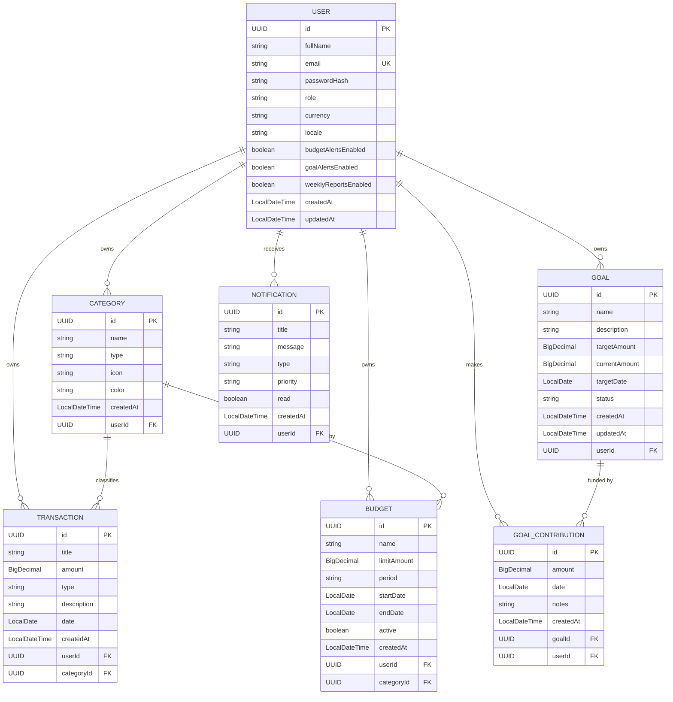

# TrackWise — Entity Relationship Diagram

## ER Diagram

---

## Entity Descriptions

### USER

The root entity for the application. Every other entity is scoped to a `USER`.
`passwordHash` stores a BCrypt hash — the plain-text password is never persisted.
`role` is always `USER` in v1.0.0 (admin role reserved for v2.0).

| Column | Type | Notes |
| --- | --- | --- |
| `id` | UUID | Primary key, auto-generated |
| `fullName` | VARCHAR | User's display name |
| `email` | VARCHAR | Unique, used for login |
| `passwordHash` | VARCHAR | BCrypt strength-10 hash |
| `role` | ENUM | `USER` (v1.0.0 only) |
| `currency` | VARCHAR | User preference label (e.g. `USD`) |
| `locale` | VARCHAR | User preference (e.g. `en-US`) |
| `budgetAlertsEnabled` | BOOLEAN | Notification toggle |
| `goalAlertsEnabled` | BOOLEAN | Notification toggle |
| `weeklyReportsEnabled` | BOOLEAN | Notification toggle |
| `createdAt` | TIMESTAMP | Auto-set on insert |
| `updatedAt` | TIMESTAMP | Auto-set on update |

---

### CATEGORY

User-scoped label for transactions and budgets. Each user manages their own
categories independently. Categories carry an icon (Lucide React name) and a
color (hex or CSS value) for visual identity.

| Column | Type | Notes |
| --- | --- | --- |
| `id` | UUID | Primary key |
| `name` | VARCHAR | e.g. "Groceries" |
| `type` | ENUM | `INCOME` or `EXPENSE` |
| `icon` | VARCHAR | Lucide icon name |
| `color` | VARCHAR | Hex color |
| `userId` | UUID FK | Owner (`USER.id`) |
| `createdAt` | TIMESTAMP | Auto-set on insert |

---

### TRANSACTION

Records a single financial event (income or expense) for a user on a specific date.
The `categoryId` is nullable to allow uncategorized transactions.

| Column | Type | Notes |
| --- | --- | --- |
| `id` | UUID | Primary key |
| `title` | VARCHAR | Short description |
| `amount` | DECIMAL(19,2) | Positive value |
| `type` | ENUM | `INCOME` or `EXPENSE` |
| `description` | TEXT | Optional long description |
| `date` | DATE | Transaction date |
| `userId` | UUID FK | Owner |
| `categoryId` | UUID FK | Nullable |
| `createdAt` | TIMESTAMP | Auto-set on insert |

---

### BUDGET

Defines a spending limit for a category over a period. The `limitAmount` is
compared against the sum of `TRANSACTION.amount` for the matching user +
category + date range to compute "spent so far".

| Column | Type | Notes |
| --- | --- | --- |
| `id` | UUID | Primary key |
| `name` | VARCHAR | e.g. "Monthly Groceries" |
| `limitAmount` | DECIMAL(19,2) | Spending ceiling |
| `period` | ENUM | `MONTHLY`, `WEEKLY`, `CUSTOM` |
| `startDate` | DATE | Period start |
| `endDate` | DATE | Period end (nullable for MONTHLY) |
| `active` | BOOLEAN | Soft-disable without deleting |
| `userId` | UUID FK | Owner |
| `categoryId` | UUID FK | Budget scope |
| `createdAt` | TIMESTAMP | Auto-set on insert |

---

### GOAL

A savings target with a name, description, target amount, and deadline.
`currentAmount` is computed as the sum of its contributions (not stored redundantly
after each contribution — it is updated atomically).

| Column | Type | Notes |
| --- | --- | --- |
| `id` | UUID | Primary key |
| `name` | VARCHAR | e.g. "Emergency Fund" |
| `description` | TEXT | Optional |
| `targetAmount` | DECIMAL(19,2) | Goal ceiling |
| `currentAmount` | DECIMAL(19,2) | Running total of contributions |
| `targetDate` | DATE | Deadline |
| `status` | ENUM | `IN_PROGRESS`, `COMPLETED`, `CANCELLED` |
| `userId` | UUID FK | Owner |
| `createdAt` | TIMESTAMP | Auto-set on insert |
| `updatedAt` | TIMESTAMP | Auto-set on update |

---

### GOAL_CONTRIBUTION

Records each deposit made toward a `GOAL`. Cascade delete: when a goal is
deleted, all its contributions are also removed.

| Column | Type | Notes |
| --- | --- | --- |
| `id` | UUID | Primary key |
| `amount` | DECIMAL(19,2) | Deposit amount |
| `date` | DATE | Contribution date |
| `notes` | TEXT | Optional note |
| `goalId` | UUID FK | Parent goal |
| `userId` | UUID FK | Owner |
| `createdAt` | TIMESTAMP | Auto-set on insert |

---

### NOTIFICATION

An in-app alert sent to a user. Notifications are created programmatically by
the backend when business events occur (e.g. budget exceeded, goal milestone).

| Column | Type | Notes |
| --- | --- | --- |
| `id` | UUID | Primary key |
| `title` | VARCHAR | Alert title |
| `message` | TEXT | Alert body |
| `type` | ENUM | `BUDGET_ALERT`, `GOAL_MILESTONE`, `SYSTEM` |
| `priority` | ENUM | `LOW`, `MEDIUM`, `HIGH` |
| `read` | BOOLEAN | Default false |
| `userId` | UUID FK | Recipient |
| `createdAt` | TIMESTAMP | Auto-set on insert |

---

## Relationships

| Relationship | Cardinality | Notes |
| --- | --- | --- |
| `USER` → `CATEGORY` | 1 : N | Each user owns multiple categories |
| `USER` → `TRANSACTION` | 1 : N | Each user owns multiple transactions |
| `USER` → `BUDGET` | 1 : N | Each user owns multiple budgets |
| `USER` → `GOAL` | 1 : N | Each user owns multiple goals |
| `USER` → `GOAL_CONTRIBUTION` | 1 : N | Each user makes multiple contributions |
| `USER` → `NOTIFICATION` | 1 : N | Each user receives multiple notifications |
| `CATEGORY` → `TRANSACTION` | 1 : N | A category classifies multiple transactions |
| `CATEGORY` → `BUDGET` | 1 : N | A category can have multiple budgets |
| `GOAL` → `GOAL_CONTRIBUTION` | 1 : N | A goal accumulates multiple contributions (cascade delete) |

---

## Constraints

| Table | Constraint | Detail |
| --- | --- | --- |
| `USER` | `UNIQUE(email)` | No duplicate accounts |
| `TRANSACTION` | `amount > 0` | Enforced at application layer via `@Valid` |
| `BUDGET` | `limitAmount > 0` | Enforced at application layer |
| `GOAL` | `targetAmount > 0` | Enforced at application layer |
| `GOAL_CONTRIBUTION` | `CASCADE DELETE` | Contributions removed with goal |
| All tables | `NOT NULL` on required fields | Enforced via `@Column(nullable = false)` |

---

## Indexes

Hibernate creates the following indexes automatically from foreign key constraints:

| Table | Index | Columns |
| --- | --- | --- |
| `CATEGORY` | FK index | `user_id` |
| `TRANSACTION` | FK index | `user_id`, `category_id` |
| `BUDGET` | FK index | `user_id`, `category_id` |
| `GOAL` | FK index | `user_id` |
| `GOAL_CONTRIBUTION` | FK index | `goal_id`, `user_id` |
| `NOTIFICATION` | FK index | `user_id` |
